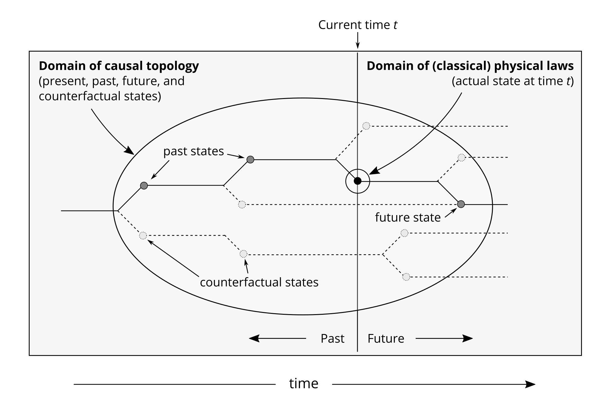

## Introduction
Progress in neuroscience and AI has lead to growing speculation about conscious machines and the possibility of "uploading" human minds into digital substrates. Several organizations offer brain preservation services on the premise that future technology will allow their customers' identities to be transferred to artifical systems [@regalado_startup_2018]. Philosophical assumptions behind much of the discussion of conscious AI and "mind uploading" include computationalism -- the thesis that consciousness is a result of neural computations -- and physicalism -- the thesis that consciousness is a function of, or supervenes on, the physical world [@sandberg_whole_2008].

In this paper, we look at the relationship between these two theses, and investigate whether strong and well-defined versions of physicalism and computationalism are compatible. This revolves around implementation: the relationship between an abstract computation and the physical system that implements it. We argue neither for or against computationalism or physicalism, but instead focus on whether implementation, particularly as defined by causal topology in Chalmers (2011), is in principle reducible to classical physics. 

## Definitions

The words physicalism and computationalism can have a variety of meanings. For the purposes of this discussion, we will define *abstract computationalism* to be the view that conscious experience is the result of classical computations that occur in the brains or nervous systems of conscious animals, and that, were these same computations to occur in another physical system (such as a digital computer), the same consciousness would be experienced. That is to say, abstract computationalism asserts that for any conscious experience $E$, there is a classical computation $C$ that is necessary and sufficient for its existence, and by which it is completely specified, such that there can be no change in $E$ without a corresponding change in $C$.

We're restricting our discussion to classical computation because this seems to be the working assumption within mainstream cognitive science. If consciousness-supporting computation cannot be reduced to classical physics, but requires recourse to quantum features of the physical world, then we are already beyond the realm of computationalism as normally understood [@rescorla_computational_2017]. 

We call this *abstract computationalism* to clearly distinguish it from a computational description of the human mind. It asserts that the computation can occur in any system that satisfies the requirements of a universal computer. As long as the computation exists, so too will the experience.

We can notate the claim of AC in the implication relation between a computation $C$ and a conscious experience $E$:

$$C \Rightarrow E$$

For the purposes of this discussion, we define *causal physicalism* (CP) to be the view that:

For any conscious experience $E$ there is a physical process $P$ that is necessary and sufficient for its existence, and by which it is completely specified, such that any change in $E$ has to be caused by a corresponding change in $P$.[^1]

[^1]: It could be argued that this is too strong a definition, and that there could be randomness or noise in the relation between $P$ and $E$. However, if such randomness is introduced in the physical system, then it must be included in $P$; if it is introduced outside the physical system, for example in some mapping function from $P$ to $E$, then it is outside physicalism and would require an aphysical form of causation. 

$$P \Rightarrow E$$

In this discussion, *physicalism* and *computationalism* are taken to mean *abstract computationalism* and *causal physicalism* as defined above.

### Computational physicalism

For both computationalism and physicalism to be true, there has to be some physical process that underlies a computation, wherever it occurs. For any $C$, there has to be some $P$ by which is specified, so that physicalism and computationalism can be joined:

$$P \Rightarrow C \Rightarrow E$$

## Initial challenges for computational physicalism

Challenges to computational physicalism hinge on the question of implementation: what does it mean for a physical system to implement a computation? Though this seems a very basic, possibly even silly question, it does not seem to have a well-accepted answer.

The lack of a formal understanding of what it means for a physical system to implement or not implement a computation has left computationalism vulnerable to trivialization arguments. Such arguments, including those by Putnam [-@putnam_representation_1988], Searle [-@searle_rediscovery_1992], Chalmers [-@chalmers_does_1996] and Scheutz [-@scheutz_implementation:_1998] follow the basic form of taking an accepted computational formalism, such as a Finite State Automaton (FSA), and attempting to demonstrate that any open physical system (or such a system plus a combination of simple components such as a clock and a dial) can be shown to implement the computation, just by defining a mapping from physical states of the system to formal states of the computation.

Trivialization arguments are formally strong but intuitively weak. Clearly there must be a difference between something that computes and something that does not! The problem must just be with defining the implementation properly. This has been the view of the authors of many trivialization arguments, and the development of these arguments has occurred concurrently with arguments about how to avoid them. This has lead to a sort of trivialization arms race, with increasingly sophisticated trivializations being countered by increasingly sophisticated definitions of implementation. The persistence of the problem of trivilaization can lead to the suspicion that there is something more fundamental at play than the lack of a good account of implementation.

Computationalism faces three less formal but perhaps more intuitively compelling challenges.

### Computations underspecify physical systems
If computationalism is true, the pattern of neural activity in a human brain could be simulated on a computer made out of silicon chips, or in a Turing machine, or in an upgraded Babbage analytical engine with a lot of moving gears, or even in a gargantuan computer made of bowling balls and wooden troughs and baffles; in the midst of those bowling balls and troughs would be the same subjective experience that is occurring in the human brain.[^2] However counterintuitive this may seem, it appears to be an unavoidable implication of the thesis of computational sufficiency. Such a substrate-independent computation is also independent of the basic physical attributes -- such as position, momentum, charge, mass, chemical composition -- that define known natural phenomena, and that would be expected to define an as-yet-poorly-understood natural phenomenon such as consciousness.

[^2]: Of course, some especially-cumbersome kinds of computers may not be able to implement a consciousness-supporting computation without exceeding the duration or size of the universe. This doesn't concern us here, however, as long as there are *some* sufficiently efficient computers of diverse architectures that would be able to implement such a computation in principle, which seems likely to be the case

### Higher-level computations underspecify lower-level computations
Even in a specific physical machine implementing a specific computation, there is a great deal of potential variety in the implementation's physical states, because one computation can implement another. Take the case of a computation of binary addition running on my laptop: the computation could be compiled into machine code and run directly on the laptop's CPU; or, it could be run in a Turing machine simulation, implemented in JavaScript, interpreted by a C program running on the CPU. Even in the same computation, on the same machine, what is occurring at the level of physical implementation is different in these two scenarios. This variation is in principle infinite, because we can simply take two or more software models and stack them up indefinitely. At every step, the physical implementation changes.

### Physical systems underspecify computations
The ambiguities become even more extreme in the case of a system such as the human brain, in which the relevant computation is not defined *a priori*. In this case the extent (how much of the nervous system), depth (the minimum size of constituents), and comprehensiveness (variety of properties, such as electrical potentials, chemicals, motion and position of constituents, etc.) that need to be included in the computation is unknown, and a myriad of different computations could be said to underlie the same conscious experience.

We can summarize these challenges as follows:

 * A computation can be implemented by many different physical systems that share few, if any, physical properties;
 * A computation can be implemented by other computations, such that even within the same physical system there are an infinite number of possible physical implementations of one computation;
 * For a given physical system (with a given conscious experience), there is are infinite number of different computational descriptions, depending on the extent, depth, and comprehensiveness of the description.

Without a rigorous account of implementation, we are left with the possibility that the problem is not that we haven't yet figured out how to define computation physically, but that such a definition is in principle impossible because computation is essentially a matter of interpretation. While such a conclusion is conceivable, it would be problematic for computationalism as a physically-grounded explanation of consciousness. 

In order to keep computational physicalism out of this situation, we would need to do two things:

 * Identify the consistent physical process $P$ that exists in a physical system if and only if that system realistically implements a given computation;
 * Demonstrate that this process is in principle reducible to physical laws

## The causal topology account of implementation

David Chalmers [-@chalmers_computational_2011] proposed an account of implementation that was intended to clear up the difficulties surrounding computation and physical implementation in the context of consciousness and cognitive science. [^3] 

[^3]: Chalmers' 2011 paper was originally written and posted on his website in 1993. It was finally published, largely unaltered, in a special issue of the Journal of Cognitive Science along with responses in 2011. Between 1993 and 2011, Chalmers' own view may have moved somewhat away from strict versions of both computationalism and physicalism, as mentioned in a footnote to the 2011 version. Nevertheless his account of implementation seems to be perhaps the best attempt at connecting computation and physical reality to date.

In his account, Chalmers identified *causal topology*, or a substrate-independent pattern of causal relations, as the essential physical correlate of an abstract computation with the ontological power to produce consciousness:

“... the central property of computation on which I will focus is [...] the fact that a computation provides an abstract specification of the causal organization of a system. Causal organization is the nexus between computation and cognition. If cognitive systems have their mental properties in virtue of their causal organization, and if that causal organization can be specified computationally, then the thesis of computational sufficiency is established.” [@chalmers_computational_2011]

“The causal topology represents the abstract causal organization of the system: that is, the pattern of interaction among parts of the system, abstracted away from the make-up of individual parts and from the way the causal connections are implemented. Causal topology can be thought of as a dynamic topology analogous to the static topology of a graph or a network.” [@chalmers_computational_2011]

Chalmers also defined a new computational formalism, the Combinatorial State Automaton (CSA), designed to avoid trivialization and accommodate a rigorous connection to the physical. A CSA is similar to a Finite State Automaton except that each state is represented by a vector of substates, and the implementation of these substates can be constrained by certain rules, such as the spatial separation of substates.

The details of this formalism and its implementation constraints we will not go into here, except in one key respect. To avoid trivial implementations, Chalmers' account requires that for a computation to be implemented, the physical system it's implemented in must satisfy the counterfactual requirement: the system's physical states and transition rules must fully match the potential formal states and transition rules of the computation, *even for states and transitions that never occur in the computation*. This means that the system can't merely reflect the trace of the computation's actual state transitions (as systems in some trivialization arguments do), but must also include states and transitions the computation might have entered if, for example, the input had been different.

Questions about whether the CSA/CT account successfully evades trivialization, or is a suitable vehicle for a general understanding of implementation, have been raised (eg by @scheutz_what_2012 and @brown_combinatorial-state_2012). For the purposes of this discussion we will assume that the account holds as defined.

## Causal topology as process $P$

In order for the causal topology account to handle the three challenges above, it has to provide a way of specifying a computation that:

1. Is abstract enough to allow a causal-topologically equivalent computation to be run in radically different architectures (such as a discrete, sequential, binary computer and a continuous, parallel biological brain); and
2. Is specific enough that implementing systems can be guaranteed to share relevant causal structure.

Before we can determine if this is possible, we need to be a bit more clear about what we mean by "causal structure". Although a pattern or structure of causal relationships seems intuitively simple to grasp, Chalmers has not described what this means precisely other than to say that it is captured by the CSA formalism and that it is "the pattern of interaction among parts of the system." As Chalmers has pointed out, though, the pattern of interaction occurs at many levels, not all of which are substrate-independent.

In order to see better how this may play out in an actual implementation, we will consider an extremely simple computation of natural number addition, this time constrained for simplicity to a maximum input value of 4.

We can now define a CSA that implements an addition function

$f(x,y) = x+y$

where x and y are natural numbers constrained as

$x, y \leq 4$

and consider two systems that implement this CSA.

We will define the CSA in the most high-level manner possible: the CSA will have an input state and an internal state for each possible input value, a "no input" internal state, an output state for each output value, and a set of transition rules that lead from each possible combination of input and internal state to the appropriate output state.

Let $M$ be a CSA with input states  $I_1, I_2, I_3, I_4$, internal states $S_0 S_1, S_2, S_3, S_4$, and output states $O_1, O_2, ... O_8$. For each input state, it either records the input by transitioning to the appropriate internal state (if in $S_0$), or resets the internal state while setting the output state to match the combination of internal and input states (so that for example, $[I_3,S_2] => [S_0,O_5]$) if in an internal state other than $S_0$. To minimally include the combinatorial features of CSAs, we can say that each input, internal, and output state is a two dimensional vector, the first component of which is mapped to the physical features described below, while the second component is mapped to a spatially distinct part of each system that remains static throughout the computation.

We can now consider two implementations of this CSA:

The first implementation is a very simple binary adding circuit consisting of a 2-bit input register, two flip-flops that store the internal state, two cascaded binary adder circuits, and a three-bit output register. On the first program step the two input bits are stored in the flip flops, and on the second step the value of each input and corresponding flip-flop is added and written to the output register.

The second implementation consists of a system of three containers, arranged one above the other, with baffles in the bottom of each. Input in the form of marbles is added to the first container. The marbles are then transferred to a memory container while the next number is added to the input container, and then both input and memory containers are emptied into the output container.

Both of these systems implement the CSA as specified. Do they share the same causal topology? It seems intuitively implausible, since the internal structure and causal relationships of the two systems are very different. Their only similarity is that, through the appropriate interpretation, we can understand their inputs and outputs as equivalent. Since the CSA/CT account doesn't offer a formal definition of causal topology other than that of the CSA, we are left with two options:

 - S1 and S1 have the same causal topology, in which case an I/O level CSA description is sufficient to establish computational equivalence; or
 - S1 and S2 have different causal topology, in which case the CSA does not effectively specify causal topology, and additional requirements regarding the level at which the CSA is defined are required.

If the former, we are in a difficult position because we are faced with the inevitability of computations that allegedly share the same causal topology but are intuitively bogus (for example a computation that implements the function $f(x) = 10x$ by displaying the input on a screen with a circle to the right of it).

To avoid this, we will assume that the latter is true, and these systems both implement the CSA but don't share the same causal topology.

It could be argued that this is a misuse of the CSA formalism, since this CSA is defined at an excessively high level (resulting in the possibility of very disparate implementations and an unconcise CSA). This is no doubt true. It is instructive, however, in that these are in a sense "real" implementations. They are not trivial in the sense of trivialization arguments (since they are *usable* computers for their very limited task, in a sense that a rock, table, or wall is not), and they satisfy the requirements of counterfactuals. Clearly, though, if the causal topology of these systems is different, we have failed to specify enough internal structure in the CSA description, which is itself effectively at the functional, rather than algorithmic or implementation level. We can see from this that:

* Implementing a CSA does not guarantee implementation of consistent causal structure
* Differences in architecture can affect causal structure, breaking the substrate-independence of causal topology as defined by a high-level CSA

Can we describe a computation at a lower level, and retain its desired implementability across architectures while ruling out implementations in architectures that don't share causal topology?

At the outset, it is not clear how to do this. How, for example, could we create a mind-producing CSA that could describe the implementation-level causal topology of both a continuous, parallel system such as a brain and a discrete, sequential system such as a digital computer? Luckily, we don't have to. The computer can simply emulate the implementation level CSA of the brain at a higher software level. This means that, while the CSA may describe the physical implementation level of the brain, it is only describing the functional level of the discrete, sequential computer running the brain emulator. While this degree of flexibility is obviously desirable and necessary in any general computational formalism, it also means we can't rely on the CSA to give as strong a specification of its physical substrate as we might expect.

This has particular implications when considering the temporal features of implementation. In the case above, the brain is a massively parallel architecture, with millions or billions of "processes" all occurring simultaneously. The computer is a sequential architecture, with only one process occurring at a time. To handle this, the solution is to run what would be parallel processes sequentially, ensuring that processes are broken up such that dependencies between simultaneous processes are modelled correctly. This will of course allow the computer to implement the CSA description of the brain, but the spatio-temporal situation at the physical level will be considerably different. Although the causal topology of the two systems as defined by the CSA will match *over the length of the computation*, at any *particular* time the pattern of causation, what things are "pushing other things around" [@chalmers_computational_2011] in the two systems will be radically different.

While the example of parallel vs. sequential processing is particularly clear, temporal differences in (instantaneous) causal topology would likely occur across any substantial difference in machine architecture. To the extent that we could define an instantaneous causal topology, it would not be consistent across different architectures, or even between different levels of implementation within the same architecture.

This appears to imply that in order to work, causal topology has to be considered largely atemporal. That is, the causal structure of the entire timeline of a computation must be taken *in toto* as the relevant property *P* of two systems $S_1, S_2$ that both implement *C* by the causal topology account, rather than any particular temporal "slice" of the implementation.

## Physical reducibility of causal topology

The quasi-atemporal nature of causal topology seems to make it difficult to connect it rigorously to physical reality. We can see this in the following thought experiment:

Consider two physical systems: a consciousness-supporting brain, $S_1$; and a digital sequential supercomputer, $S_2$, both running the same computation.  A third system, $S_3$, is an identical hardware duplicate of $S_2$, but running an entirely different computation.

Now imagine that at some point there is an external intervention — say, someone pokes a wire with a bit of voltage on it into $S_3$ — such that at the next program step $S_3$ and $S_2$ enter the exact same physical state.

These two systems are now indistinguishable from each other physically, but their causal topology must be quite different. $S_3$ cannot have the same causal topology as $S_2$ and $S_1$, because it does not share the same counterfactual dependencies. There is no sense in which it would have *reliably transitioned* through the same state transitions as the other systems at any previous program step.

If this is true, it leads to the strange conclusion that we have one pair of systems, $S_2$ and $S_3$, which are identical physically, but with allegedly different conscious experience; and another pair, $S_1$ and $S_2$, that are very different physically, with allegedly the same experience.

Clearly, from a physicalist account of consciousness, this cannot be the case. What has gone wrong?

The problem arises because causation, per se, is not a physical quality or quantity. Causation only has bearing in the physical world if it describes something that goes on between particular objects or forces, at a particular time.  

In the causal topology account, counterfactuals are essential to the formal definition of computation that avoids  trivialization, and causal structure is the essential property that give the computation ontological status as physically real, rather than just a way that we interpret various physical systems.

If a system could have reach state $C$ from either state $A$ or state $B$, which of those states actually lead to state $C$ is significant to the system's pattern of causation. Once the system is in state $C$, though, which previous state lead there is of no *physical* significance whatsoever.[^5] 

[^5]: Of course, the complete microphysical condition of the world when the system is in state C will include, minus quantum indeterminacy, traces of the system's previous states, and indicators of its future states. This is not a solution to the problem, though, because a) indicators of past and future states may not be within the system itself; and b) causal topology has to exclude all such microphysical features in order to be substrate independent.

For causal topology, what didn't happen (but could have) matters; and what happens in the past and future (even has no effect on the present) also matters. For (classical) physics, it is only what is that matters. Past and future events, and events that might have happened but didn't, are not within the domain of classical physical laws. [^7] 

[^7]: It is interesting to note that many of the features of causal topology that are difficult to ground in classical physics are present in quantum mechanics, including causally-relevant counterfactuals. This doesn't particularly help, though, because the computations in question occur at a much larger spatio-temporal scale than the quantum features that could be used to support them. Even if the classicality constraint on our definition of physicalism was removed, there doesn't appear to be a way to ground the causal properties of macroscopic classical computations in microscopic features of quantum mechanics.

## Computation and Physical Reality

The temporal difficulties with the causal topology account are not unique to CSAs, or even to causal topology. Any substrate-independent description of a computation will be necessarily atemporal. Computations can specify *what* needs to happen, but *when* it happens is determined by the specifics of implementation. For this reason, it seems likely that substrate-independent computation will remain perpetually beyond the reach of (classical) physical laws, and so too will computationalist theories of mind and consciousness.

In some sense, this should not come as a surprise. Our language and everyday experience are replete with "things" -- such as most forms of information, symbols, concepts, and arguably computations -- that we can study and make use of, but which cannot be said to "exist" in the strong sense of being physically real, and therefor causally efficacious *per se* in the physical world.

This only becomes problematic for computation when we try to attach to it an empirical, natural phenomenon such as consciousness, while remaining within a physicalist account of nature.

## References

Brown, C. (2012). Combinatorial-state automata and models of computation.
Journal of Cognitive Science, 13 (1), 51–73. Retrieved from https://works.bepress.
com/curtis_brown/8/
Chalmers, D. J. (1996). Does a rock implement every finite-state automaton?
Synthese, 108 (3), 309–333. https://doi.org/10.1007/BF00413692
Chalmers, D. J. (2011). A computational foundation for the study of cognition.
Journal of Cognitive Science, 12 (4), 323–357.
Putnam, H. (1988). Representation and Reality. Cambridge: MIT Press.
Regalado, A. (2018). A startup is pitching a mind-uploading service that is
“100 percent fatal”. MIT Technology Review. Retrieved from https://www.
technologyreview.com/s/610456/a-startup-is-pitching-a-mind-uploading-service-that-is-100-percent-fatal/
Rescorla, M. (2017). The Computational Theory of Mind. The Stanford
Encyclopedia of Philosophy, Edward N. Zalta (ed.). Retrieved from https:
//plato.stanford.edu/archives/spr2017/entries/computational-mind/
Sandberg, A., & Bostrom, N. (2008). Whole Brain Emulation: A Roadmap
(Technical Report No. 2008-3). Future of Humanity Institute: Oxford University.
Scheutz, M. (1998). Implementation: Computationalism’s weak spot. Con-
ceptus JG, 31 (79), 229–239.
Retrieved from https://www.researchgate.
net/profile/Matthias_Scheutz/publication/237133926_Implementation_
Computationalism’s_Weak_Spot/links/55bf4db208aed621de123815.pdf
Scheutz, M. (2012). What it is not to implement a computation: A critical
analysis of chalmers’ notion of implemention. Journal of Cognitive Science
(South Korea), 13 (1), 75–106. Retrieved from https://pdfs.semanticscholar.org/
ea34/f5d8c28e67f0d5c8d6c5a00ceb72cf117c79.pdf
Searle, J. R. (1992). The rediscovery of the mind. Cambridge: MIT Press.